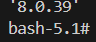

# Databases in DOCKER 


### DOCKER SHOULD BE INSTALLED ALREADY if not then install 
```bash
sudo apt install docker.io
```

## THESE ARE DIRECT COMMANDS TO BE PASTED IN THE TERMINAL ,

( make sure you are connected to the internet before executing these )

## 1) MYSQL 

```bash
docker run -it apsitv27/mysql
```


### AFTER THAT you will see this 


### JUST TYPE ```mysql```


### OR
```bash
docker run -it apsitv27/sql
```

### when using ```apsitv27/sql``` will directly launch the mysql server no need to interupt in between
### AND YOU ARE GOOD TO GO !!🫡💯

--------------------------------------

---------------

## 2) MARIA_DB

(COMING SOON )
